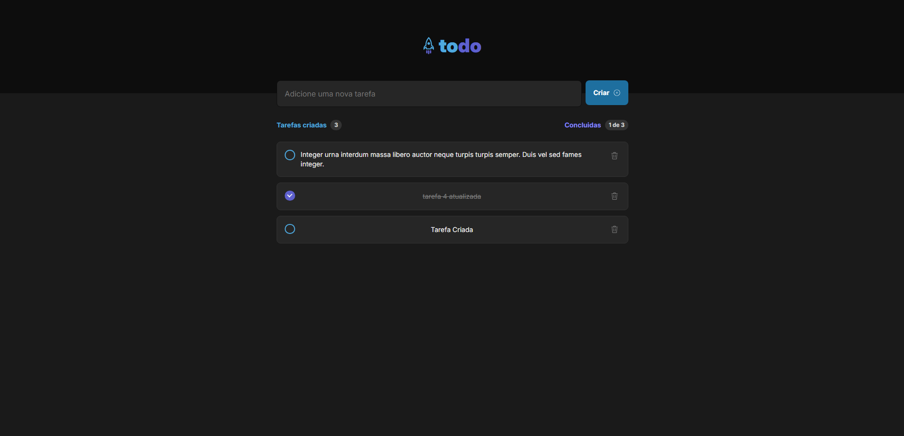

# 🎨 Frontend – ToDo Project

Interface web do projeto ToDo, desenvolvida com **React** e **Vite**, com foco em simplicidade, desempenho e componentização. Essa SPA consome a API RESTful do backend NestJS para gerenciar tarefas de forma intuitiva e responsiva.



---

## ⚙️ Tecnologias Utilizadas

- [React](https://reactjs.org/)
- [Vite](https://vitejs.dev/)
- [TypeScript](https://www.typescriptlang.org/)
- [Axios](https://axios-http.com/)
- [ESLint](https://eslint.org/)
- [Nginx (build)](https://www.nginx.com/)
- [Docker](https://www.docker.com/)

---

## 🚀 Como rodar o projeto

### 🐳 Usando Docker (recomendado)

```bash
docker build -t todo-frontend .
docker run -p 5173:80 todo-frontend
```
### 🧪 Manualmente (modo dev)
```bash
Copiar
Editar
# Instale as dependências
npm install

# Rode o projeto
npm run dev
```
A aplicação estará disponível em:
http://localhost:5173

## 🚧 Melhorias Futuras

Este projeto ainda está em desenvolvimento e novas funcionalidades e ajustes estão sendo planejados para melhorar a experiência do usuário, a organização do código e a estrutura do monorepo:

- [ ] Mobile version
- [ ] Adicionar testes unitários com Jest e React Testing Library
---


### 📂 Estrutura
```frontend/
├── public/                # Assets públicos (favicon, imagens)
├── src/
│   ├── Components/        # Componentes reutilizáveis
│   ├── assets/            # Imagens e ícones utilizados na UI
│   ├── App.tsx            # Componente principal da aplicação
│   ├── App.css            # Estilos do componente App
│   ├── index.css          # Estilos globais
│   ├── main.tsx           # Entry point
│   └── vite-env.d.ts      # Tipagens do ambiente Vite
│
├── Dockerfile             # Dockerfile para build da imagem da aplicação
├── nginx.conf             # Configuração do servidor Nginx (produção)
├── .dockerignore
├── .gitignore
├── index.html             # HTML principal usado pelo Vite
├── eslint.config.js       # Configuração de lint
├── package.json
├── package-lock.json
├── tsconfig.json
├── tsconfig.app.json
└── tsconfig.node.json
```

## 🧩 Funcionalidades

- ✅ Listar tarefas
- ➕ Criar tarefas
- ✏️ Editar tarefas
- ✔️ Marcar como concluída
- ❌ Excluir tarefas
- 💡 UI responsiva e limpa

---

## 📄 Observações

- A URL da API pode ser configurada em variáveis de ambiente (`.env`), utilizando a chave `VITE_API_URL`.
- A build de produção é servida via **Nginx**, conforme definido no arquivo `nginx.conf`.
- O projeto foi estruturado para facilitar a leitura, manutenção e escalabilidade.

